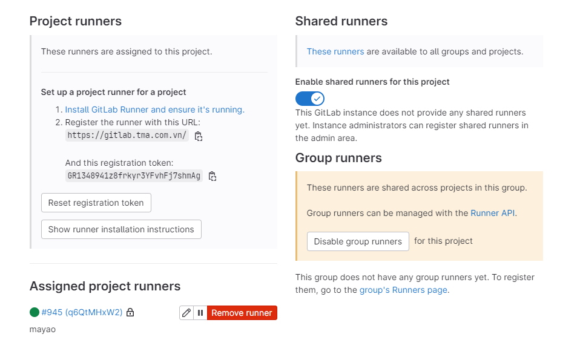
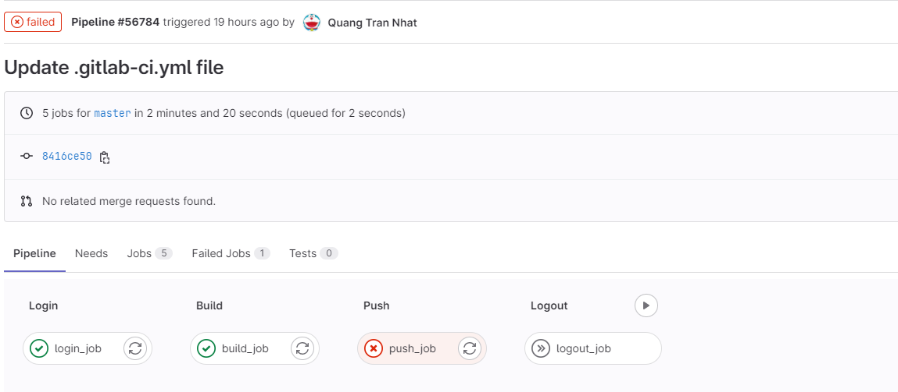
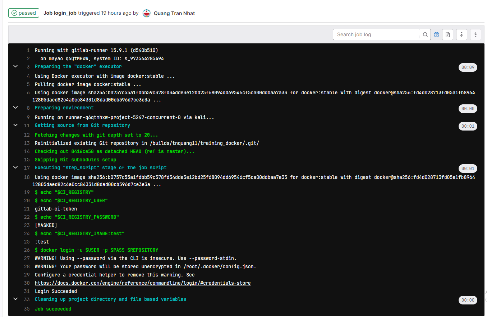

# `Gitlab CI-CD`

## `I> Overall`

### `1.1. Introduction`

GitLab CI/CD is a tool for software development using the continuous methodologies:

- Continuous Integration (CI)
- Continuous Delivery (CD)
- Continuous Deployment (CD)

Use GitLab CI/CD to catch bugs and errors early in the development cycle. Ensure that all the code deployed to production complies with the code standards you established for your app.

GitLab CI/CD can automatically build, test, deploy, and monitor your applications by using Auto DevOps.

### `1.2. Concepts`
| Concept             | Description                                                                           |
| ------------------- | ------------------------------------------------------------------------------------- |
| Pipelines           | Structure your CI/CD process through pipelines.                                       |
| CI/CD variables     | Reuse values based on a variable/value key pair.                                      |
| Environments        | Deploy your application to different environments (for example, staging, production). |
| Job artifacts       | Output, use, and reuse job artifacts.                                                 |
| Cache dependencies  | Cache your dependencies for a faster execution.                                       |
| GitLab Runner       | Configure your own runners to execute your scripts.                                   |
| Pipeline efficiency | Configure your pipelines to run quickly and efficiently.                              |
| Test cases          | Create testing scenarios.                                                             |


### `1.3. Features`
<table>
    <thead>
        <tr>
            <th style="text-align:left">Feature</th>
            <th style="text-align:left">Description</th>
        </tr>
    </thead>
    <tbody>
        <tr>
            <td style="text-align:left"><strong>Configure</strong></td>
            <td style="text-align:left">&nbsp;</td>
        </tr>
        <tr>
            <td style="text-align:left"><a href="#">Auto DevOps</a></td>
            <td style="text-align:left">Set up your app’s entire lifecycle.</td>
        </tr>
        <tr>
            <td style="text-align:left"><a href="#">ChatOps</a></td>
            <td style="text-align:left">Trigger CI jobs from chat, with results sent back to the channel.</td>
        </tr>
        <tr>
            <td style="text-align:left"><a href="#">Connect to cloud services</a></td>
            <td style="text-align:left">Connect to cloud providers using OpenID Connect (OIDC) to retrieve temporary
                credentials to access services or secrets.</td>
        </tr>
        <tr>
            <td style="text-align:left"><strong>Verify</strong></td>
            <td style="text-align:left">&nbsp;</td>
        </tr>
        <tr>
            <td style="text-align:left"><a href="#">Browser Performance
                    Testing</a></td>
            <td style="text-align:left">Quickly determine the browser performance impact of pending code changes.</td>
        </tr>
        <tr>
            <td style="text-align:left"><a href="#">Load Performance Testing</a>
            </td>
            <td style="text-align:left">Quickly determine the server performance impact of pending code changes.</td>
        </tr>
        <tr>
            <td style="text-align:left"><a href="#">CI services</a></td>
            <td style="text-align:left">Link Docker containers with your base image.</td>
        </tr>
        <tr>
            <td style="text-align:left"><a href="#">GitLab CI/CD for external
                    repositories</a></td>
            <td style="text-align:left">Get the benefits of GitLab CI/CD combined with repositories in GitHub and
                Bitbucket Cloud.</td>
        </tr>
        <tr>
            <td style="text-align:left"><a href="#">Interactive Web Terminals</a></td>
            <td style="text-align:left">Open an interactive web terminal to debug the running jobs.</td>
        </tr>
        <tr>
            <td style="text-align:left"><a href="#">Review Apps</a></td>
            <td style="text-align:left">Configure GitLab CI/CD to preview code changes.</td>
        </tr>
        <tr>
            <td style="text-align:left"><a href="#">Unit test reports</a></td>
            <td style="text-align:left">Identify test failures directly on merge requests.</td>
        </tr>
        <tr>
            <td style="text-align:left"><a href="#">Using Docker images</a></td>
            <td style="text-align:left">Use GitLab and GitLab Runner with Docker to build and test applications.</td>
        </tr>
        <tr>
            <td style="text-align:left"><strong>Release</strong></td>
            <td style="text-align:left">&nbsp;</td>
        </tr>
        <tr>
            <td style="text-align:left"><a href="#">Auto Deploy</a></td>
            <td style="text-align:left">Deploy your application to a production environment in a Kubernetes cluster.
            </td>
        </tr>
        <tr>
            <td style="text-align:left"><a href="#">Building Docker images</a></td>
            <td style="text-align:left">Maintain Docker-based projects using GitLab CI/CD.</td>
        </tr>
        <tr>
            <td style="text-align:left"><a href="#">Canary Deployments</a></td>
            <td style="text-align:left">Ship features to only a portion of your pods and let a percentage of your user
                base to visit the temporarily deployed feature.</td>
        </tr>
        <tr>
            <td style="text-align:left"><a href="#">Deploy boards</a></td>
            <td style="text-align:left">Check the current health and status of each CI/CD environment running on
                Kubernetes.</td>
        </tr>
        <tr>
            <td style="text-align:left"><a href="#">Feature Flags</a></td>
            <td style="text-align:left">Deploy your features behind Feature Flags.</td>
        </tr>
        <tr>
            <td style="text-align:left"><a href="#">GitLab Pages</a></td>
            <td style="text-align:left">Deploy static websites.</td>
        </tr>
        <tr>
            <td style="text-align:left"><a href="#">GitLab Releases</a></td>
            <td style="text-align:left">Add release notes to Git tags.</td>
        </tr>
        <tr>
            <td style="text-align:left"><a href="#">Cloud deployment</a></td>
            <td style="text-align:left">Deploy your application to a main cloud provider.</td>
        </tr>
        <tr>
            <td style="text-align:left"><strong>Secure</strong></td>
            <td style="text-align:left">&nbsp;</td>
        </tr>
        <tr>
            <td style="text-align:left"><a href="#">Code Quality</a></td>
            <td style="text-align:left">Analyze your source code quality.</td>
        </tr>
        <tr>
            <td style="text-align:left"><a href="#">Container
                    Scanning</a></td>
            <td style="text-align:left">Check your Docker containers for known vulnerabilities.</td>
        </tr>
        <tr>
            <td style="text-align:left"><a href="#">Dependency
                    Scanning</a></td>
            <td style="text-align:left">Analyze your dependencies for known vulnerabilities.</td>
        </tr>
        <tr>
            <td style="text-align:left"><a href="#">License
                    Compliance</a></td>
            <td style="text-align:left">Search your project dependencies for their licenses.</td>
        </tr>
        <tr>
            <td style="text-align:left"><a href="#">Security Test reports</a></td>
            <td style="text-align:left">Check for app vulnerabilities.</td>
        </tr>
    </tbody>
</table>

## `II> How to use ?`
### `2.1. Create Pipeline`
To Create Pipeline At First, We have to create a `.gitlab-ci.yml` file at the root of your repository. This file is where you define the CI/CD jobs.
In `.gitlab-ci.yml` file we can define:
- `before_script`: scripts will excute before each stage
- `variables`: define global variables for pipeline
- `stages`: define name of each stage 
- `job`: define job in each stage
- `script`: define actions in each job

Example:
```
before_script:
  - echo "$CI_REGISTRY"

  - echo "$CI_REGISTRY_USER"

  - echo "$CI_REGISTRY_PASSWORD"

build-job:
  stage: build
  script:
    - echo "Hello, $GITLAB_USER_LOGIN!"

test-job1:
  stage: test
  script:
    - echo "This job tests something"

test-job2:
  stage: test
  script:
    - echo "This job tests something, but takes more time than test-job1."
    - echo "After the echo commands complete, it runs the sleep command for 20 seconds"
    - echo "which simulates a test that runs 20 seconds longer than test-job1"
    - sleep 20

deploy-prod:
  stage: deploy
  script:
    - echo "This job deploys something from the $CI_COMMIT_BRANCH branch."
  environment: production
```

### `2.2. Run Pipeline`
To run a pipeline we have to have a Runner 
If your gitlab don't have any runner we can create one by following step:
- **Step 1**: Download and install gitlab-runner
`Window`: https://docs.gitlab.com/runner/install/windows.html
`Linux`: https://docs.gitlab.com/runner/install/linux-manually.html

- **Step 2**: Register gitlab-runner
https://docs.gitlab.com/runner/register/

After register a gitlab-runner we will see it in `Settings > CI/CD > Runner`

If your project have had `gitlab-runner` and `.gitlab-ci.yml` file, the pipeline will auto run step by step
 
You can see result of each step in Dashboard.



You can see details of each stage by clicking in its name

