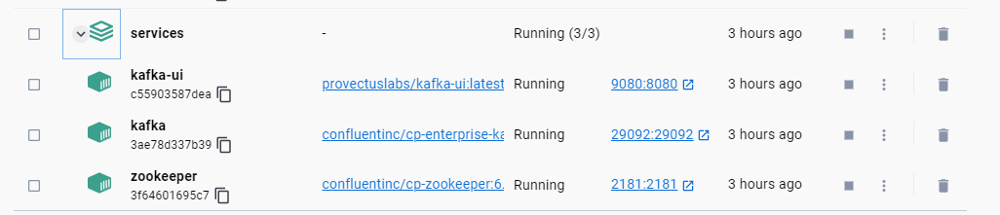
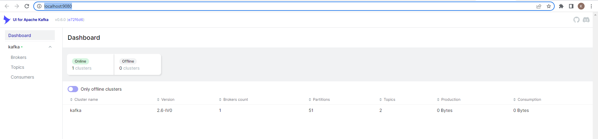

# `Apache Kafka`
## `I> Overall`
### `1.1. Introduction`
Kafka is a distributed system consisting of servers and clients that communicate via a high-performance TCP network protocol. It can be deployed on bare-metal hardware, virtual machines, and containers in on-premise as well as cloud environments.

`Servers`: Kafka is run as a cluster of one or more servers that can span multiple datacenters or cloud regions. Some of these servers form the storage layer, called the brokers. Other servers run Kafka Connect to continuously import and export data as event streams to integrate Kafka with your existing systems such as relational databases as well as other Kafka clusters. To let you implement mission-critical use cases, a Kafka cluster is highly scalable and fault-tolerant: if any of its servers fails, the other servers will take over their work to ensure continuous operations without any data loss.

`Clients`: They allow you to write distributed applications and microservices that read, write, and process streams of events in parallel, at scale, and in a fault-tolerant manner even in the case of network problems or machine failures. Kafka ships with some such clients included, which are augmented by dozens of clients provided by the Kafka community: clients are available for Java and Scala including the higher-level Kafka Streams library, for Go, Python, C/C++, and many other programming languages as well as REST APIs.

### `1.2. Architecture`

General Architecture of Apache Kafka:


Architecture details of Apache Kafka:


### `1.3. Concepts`
| Concept             | Description                                                                           |
| ------------------- | ------------------------------------------------------------------------------------- |
| TOPIC | Data transfer in Kafka by topic, when you need to pass data to different applications, it will create different topics. |
| PRODUCER  | Kafka stores and categorizes messages by topic, uses a producer to publish messages to topics. The data is sent to the topic's partition stored on the Broker.|
| CONSUMER | Kafka uses consumers to subscribe to topics, consumers are identified by group names. Multiple consumers can read the same topic.|
| CLUSTER | Kafka Cluster is a set of servers, each set in the Cluster is called a Broker |
| BROKER | Broker is a Kafka Server, acting as a bridge between Message Pulisher and Message Consumer so that these two components can exchange Messages with each other. |
| PARTITION | This is where the data for a topic is stored. A topic can have one or more partitions. On each partition, the data is stored permanently and is assigned an ID called offset. In a Kafka cluster, a partition can be replicated to many copies. There is a leader responsible for reading and writing data and the rest are called followers. When the leader version is faulty, there will be a follower version to be the replacement leader. If you want to use multiple consumers to read the data of a topic in parallel, that topic needs to have multiple partitions.|
| ZOOKEEPER | used to manage and arrange brokers.| 


### `1.3. Kafka APIs`

In addition to command line tooling for management and administration tasks, Kafka has five core APIs for Java and Scala:

- The Admin API to manage and inspect topics, brokers, and other Kafka objects.
- The Producer API to publish (write) a stream of events to one or more Kafka topics.
- The Consumer API to subscribe to (read) one or more topics and to process the stream of events produced to them.
- The Kafka Streams API to implement stream processing applications and microservices. It provides higher-level functions to process event streams, including transformations, stateful operations like aggregations and joins, windowing, processing based on event-time, and more. Input is read from one or more topics in order to generate output to one or more topics, effectively transforming the input streams to output streams.
- The Kafka Connect API to build and run reusable data import/export connectors that consume (read) or produce (write) streams of events from and to external systems and applications so they can integrate with Kafka. For example, a connector to a relational database like PostgreSQL might capture every change to a set of tables. However, in practice, you typically don't need to implement your own connectors because the Kafka community already provides hundreds of ready-to-use connectors.

### `1.4 Main Features`
- Using Kafka to deliver messages
- Event Streaming Kafka
- Storing data on the Kafka system

### `1.5. Advantage and Disadvantage`

**`Advantage:`**

- Open source
- High Throughput: Capable of processing large amounts of information in a - continuous manner, with almost no waiting time
- High frequency: Can handle many messages and many types of topics at the same time
- Scalability: Easily expand as needed
- Automatically archive messages, easy to check back
Large user community, quick support when needed

**`Disadvantage:`**

- There is no complete set of monitoring tools: There are many different tools, but each tool only meets a certain management feature, such as: Kafka tool (offset manager) GUI tool - managing topics and consumers, Lense - support query message, Akhq - Kafka management toolbox and view data inside Kafka
- Can't select topic by wildcard: User will need to use exact topic name to process message
- Reduced performance: Increasing message size causes consumers and producers to compress and decompress messages, thereby slowing down memory, affecting throughput and performance.
- Slow processing: Sometimes the number of queues in Kafka cluster spikes causing Kafka to process slower.

## `II> How to set up`
To create Apache Kafka service we have to install two things:
- Apache Kafka
- Zookeeper

### `2.1. Install Manual`
We can download binary source from apache site:
- Apache Kafka: https://kafka.apache.org/downloads
- Zookeeper: https://zookeeper.apache.org/releases.html#download

After download we can run manual by SH script in each source

### `2.2. Install in Docker`
We can use following docker compose script below:
```
version: '3'
services:
  zookeeper:
    image: confluentinc/cp-zookeeper:6.0.0
    hostname: zookeeper
    container_name: zookeeper
    ports:
      - "2181:2181"
    environment:
      ZOOKEEPER_CLIENT_PORT: 2181
      ZOOKEEPER_TICK_TIME: 2000
    networks:
      - kafka

  kafka:
    image: confluentinc/cp-enterprise-kafka:6.0.0
    hostname: kafka
    restart: "always"
    container_name: kafka
    depends_on:
      - zookeeper
    ports:
      - "29092:29092"
    environment:
      KAFKA_BROKER_ID: 1
      KAFKA_ZOOKEEPER_CONNECT: 'zookeeper:2181'
      KAFKA_LISTENER_SECURITY_PROTOCOL_MAP: |
         PLAINTEXT:PLAINTEXT,PLAINTEXT_HOST:PLAINTEXT
      KAFKA_ADVERTISED_LISTENERS: |
         PLAINTEXT://kafka:9092,PLAINTEXT_HOST://localhost:29092
      KAFKA_OFFSETS_TOPIC_REPLICATION_FACTOR: 1
      KAFKA_TRANSACTION_STATE_LOG_REPLICATION_FACTOR: 1
    networks:
      - kafka

  kafka-ui:
    image: provectuslabs/kafka-ui:latest
    container_name: kafka-ui
    restart: "no"
    ports:
      - "9080:8080"
    environment:
      KAFKA_CLUSTERS_0_NAME: "kafka"
      KAFKA_CLUSTERS_0_BOOTSTRAPSERVERS: "kafka:9092"
    networks:
      - kafka

networks:
  kafka: 
    external:
      name: kafka
```

In above script, we have 3 service in docker, it contains zookeeper, kafka and  kafka-ui, each service interact together by kafka network.

After run above script we will have 3 service in docker container



Access to `http://localhost:9080/` we will see UI for Kafka managerment



## `III> How to use in Quarkus ?`

To implement in quarkus we have to add library to support Kafka 

In `properties` file we have to define instruction for kafka to create topic and receive message from topic

```
kafka.bootstrap.servers=http://localhost:29092

# Configure the Kafka source (we read from it)
mp.messaging.incoming.gas-in.connector=smallrye-kafka
mp.messaging.incoming.gas-in.topic=gas
#mp.messaging.incoming.gas-in.value.deserializer=com.example.kafka.GasDeserializer

# Configure the Kafka sink (we write to it)
mp.messaging.outgoing.gas-out.connector=smallrye-kafka
mp.messaging.outgoing.gas-out.topic=gas
mp.messaging.outgoing.gas-out.value.serializer=io.quarkus.kafka.client.serialization.ObjectMapperSerializer
````

about property code will register topic has name "gas" in Kafka and config path to read and send data in kafka

To send data to kafka we have to use following code
```
    @Inject
    @Channel("gas-out")
    Emitter<Gas> gasEmitter;
```

To read data from Kafka we have to register a consumer 
```
    @Incoming("gas-in")
    public void outputGas(Gas gas){
        System.out.printf("Gas price has been increased to %s",gas.price);
    }
```

After finished steps above we can send data to check Kafka

Code to test:
```
curl -X 'POST' \
  'http://localhost:8080/gas' \
  -H 'accept: */*' \
  -H 'Content-Type: application/json' \
  -d '{
  "name": "Xăng A999",
  "price": 222222666
}
```

Result:
```
2023-03-17 13:59:41,180 INFO  [io.sma.rea.mes.kafka] (Quarkus Main Thread) SRMSG18229: Configured topics for channel 'gas-in': [gas]
2023-03-17 13:59:41,197 INFO  [io.sma.rea.mes.kafka] (Quarkus Main Thread) SRMSG18214: Key deserializer omitted, using String as default
2023-03-17 13:59:41,419 INFO  [io.sma.rea.mes.kafka] (smallrye-kafka-producer-thread-0) SRMSG18258: Kafka producer kafka-producer-gas-out, connected to Kafka brokers 'http://localhost:29092', is configured to write records to 'gas'
2023-03-17 13:59:41,453 INFO  [io.sma.rea.mes.kafka] (smallrye-kafka-consumer-thread-0) SRMSG18257: Kafka consumer kafka-consumer-gas-in, connected to Kafka brokers 'http://localhost:29092', belongs to the 'kafka-demo' consumer group and is configured to poll records from [gas]
2023-03-17 13:59:41,549 INFO  [io.quarkus] (Quarkus Main Thread) kafka-demo 1.0-SNAPSHOT on JVM (powered by Quarkus 2.16.4.Final) started in 3.369s. Listening on: http://localhost:8080
2023-03-17 13:59:41,549 INFO  [io.quarkus] (Quarkus Main Thread) Profile dev activated. Live Coding activated.
2023-03-17 13:59:41,550 INFO  [io.quarkus] (Quarkus Main Thread) Installed features: [cdi, kafka-client, resteasy-reactive, resteasy-reactive-jackson, resteasy-reactive-jsonb, smallrye-context-propagation, smallrye-reactive-messaging, smallrye-reactive-messaging-kafka, vertx]
2023-03-17 14:01:06,533 INFO  [io.sma.rea.mes.kafka] (vert.x-eventloop-thread-3) SRMSG18256: Initialize record store for topic-partition 'gas-0' at position 13.
Gas price has been increased to 3.33333999E8
```

All of source code you will see at: https://github.com/TranNhatQuang2405/Kafka_Quarkus